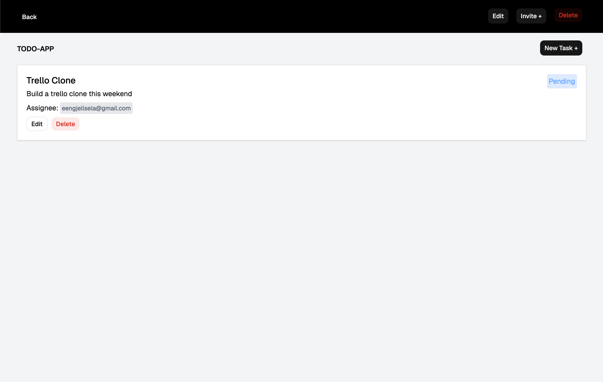
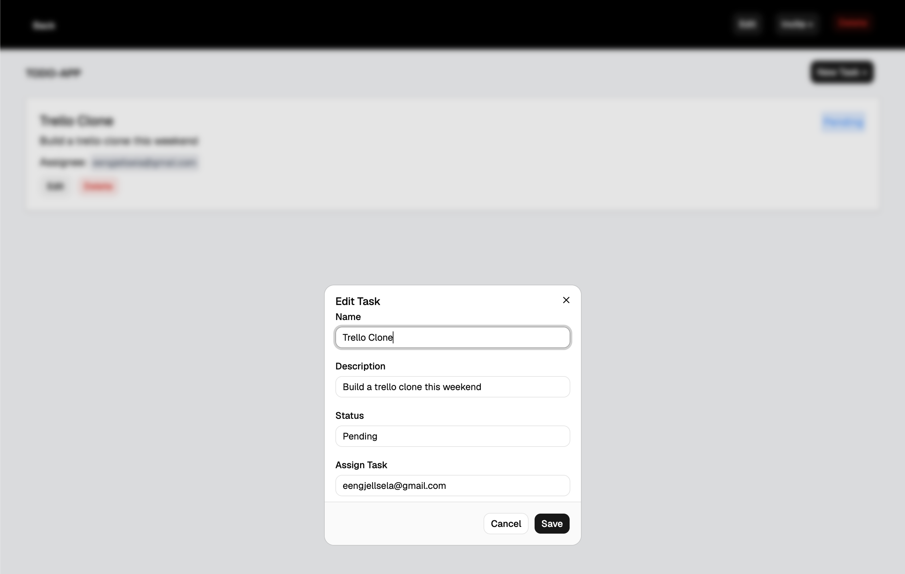

# Mini Trello

A mini trello app for small project and task management.

## Features
- Authentication with Supabase
- Create projects
- Invite user to project by email
- Create, edit and delete tasks
- UI interface built with TailwindCSS

## Built with
- React
- Typescript
- Vite
- TailwindCSS
- shadcn/ui
- Supabase

## Database Schema
# accounts
- id: uuid, primary key
- email: text, unique key
- created_at: timestamptz

# projects
- id: uuid, primary key
- name: text,
- userID: uuid, foreign key to accounts.id
- created_at: timestamptz

# members
- id: uuid, primary key
- projectName: text
- status: text
- projectID: uuid, foreign key to projects.id
- userID: uuid, foreign key to accounts.id
- created_at: timestamptz

# tasks
- id: uuid, primary key
- name: text
- description: text
- status: text
- projectID: uuid, foreign key to projects.id
- assignTo: text, foreign key to accounts.email
- created_at: timestamptz

# Getting started

Install:

`npm install`

Start the development server:

`npm run dev`

# Images

